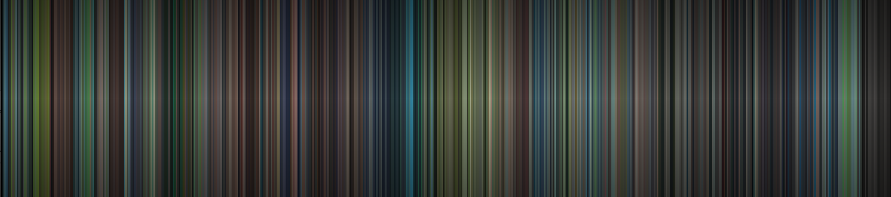
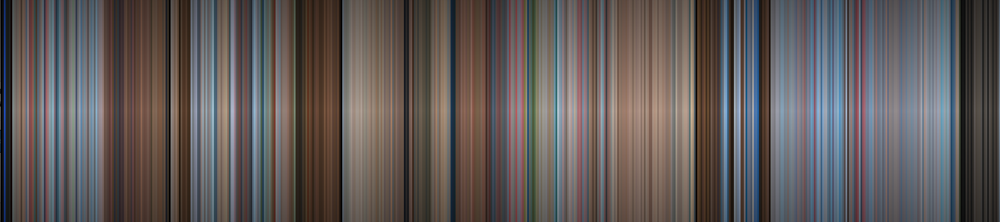

<h1 align="center">
    MovieSpectrum
</h1>

<b>MovieSpectrum is a (very) simple program that you can use to extract the color sequential timeline of a film or a video</b>

# How to use it?
Define the script parameters in params.py.
You will have to adjust IMAGE_WIDTH, IMAGE_HEIGHT for the output picture, and SAMPLE_NUMBER to define the number of frames to be used to build the spectrum.

Then, from a terminal supply a video path :

    spectrum.py Porco\ Rosso.avi

# Averaging methods
You can also play with average methods, square average seems to give the best results.
K-Mean seems rather unpratical unless you are working with a very small SAMPLE_NUMBER.

A window will popup and the spectrum will start building. When you are finished, press Q to exit.

# Dependencies
* <a href="https://github.com/numpy/numpy">Numpy</a>
* <a href="https://github.com/opencv/opencv">OpenCV</a>

# Some examples
Here are some cool examples built using the script, from some famous Ghibli movies.

Princess Mononoke

<h1 align="center">
    
</h1>

Porco Rosso

<h1 align="center">
    
</h1>
